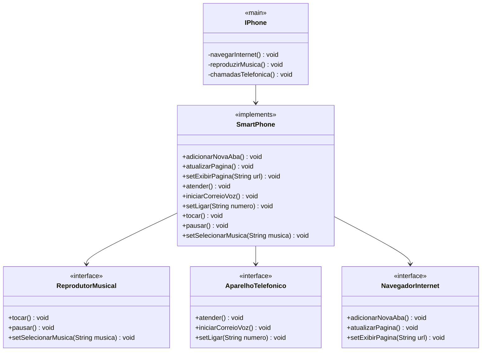

# Desafio BootCamp Desenvolvimento Java com IA - DIO
## Entendendo o desafio proposto
**Descrição do Desafio:** Colocar em prática toda a concepção de análise de negócios, requisitos, conceitos da programação orientada a objetos e modelagem UML. Com base no vídeo de lançamento do iPhone conforme link abaixo, elaborar a diagramação UML das classes e interfaces com a proposta de representar os papéis do iPhone de: Reprodutor Musical, Aparelho Telefônico e Navegador na Internet. Em seguida criando classes e interfaces no formato de arquivos .java 

[**Lançamento iPhone 2007**](https://www.youtube.com/watch?v=9ou608QQRq8) - Minutos relevantes: 00:15 até 00:55

**Pré-requisitos:**
    Lógica de programação e POO;
    Conhecimentos básicos(Java);

[Clicar aqui para mais detalhes do desafio!](https://github.com/digitalinnovationone/trilha-java-basico/tree/main/desafios/poo)

### Modelando o iPhone com UML: Funções de Músicas, Chamadas e Internet

